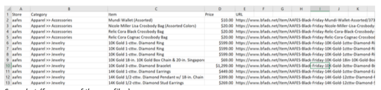
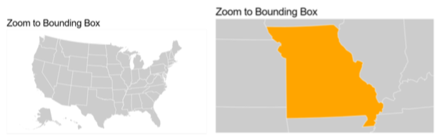
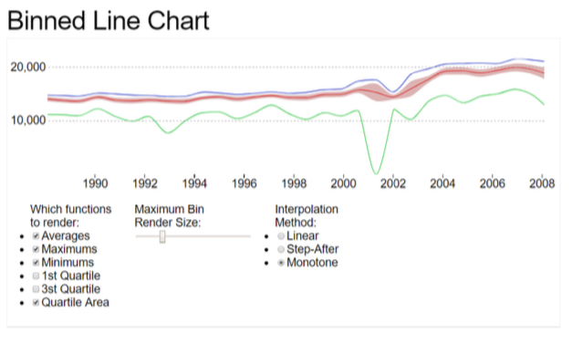
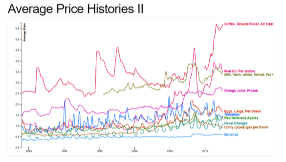

# Doorbusters

# Proposal: Black Friday Advertised Deals

## Team Name

_Doorbusters_

## Topic and Rationale

With Black Friday among us, we thought it would be interesting to research Black Friday advertisements
across multiple retailers and look for deal trends in various product categories. As such, we would like to
explore and present data on Black Friday advertisements in the U.S. from 2011-2017.

## Dataset

We decided to use datasets featured on:

[https://www.bfads.net/forums/viewtopic.php?f=25&t=34409](https://www.bfads.net/forums/viewtopic.php?f=25&t=34409)

We chose this dataset because it includes data on advertisements from multiple stores, including
products, and the offered deal. Our dataset covered the following years: 2011, 2012, 2013, 2014, 2015,
2016, 2017.

_Snapshot (from one of the .csv files)_

## Data Flow Diagram

## Visualizations

- **VISUALIZATION #1** : Geo map of United States overlay with store locations across US

- **VISUALIZATION #2** : Products by year, options to choose category and/or store.

- **VISUALIZATION #3** : Compare deals/most advertised products by year, interactive hover, let user choose
the category

## Sketch of Final Design

## GitHub Repository

- [https://github.com/lvondracek7/Doorbusters](https://github.com/lvondracek7/Doorbusters)

